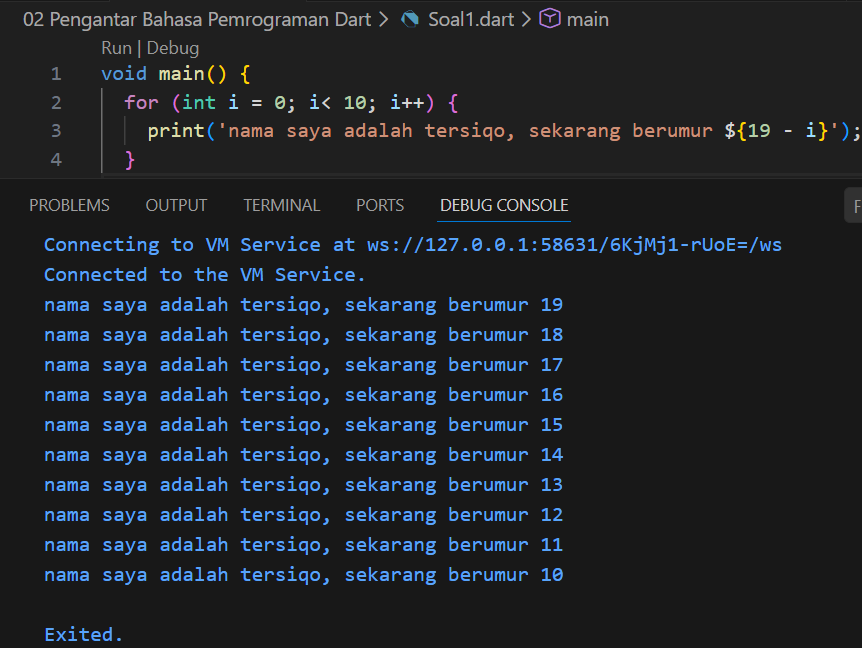
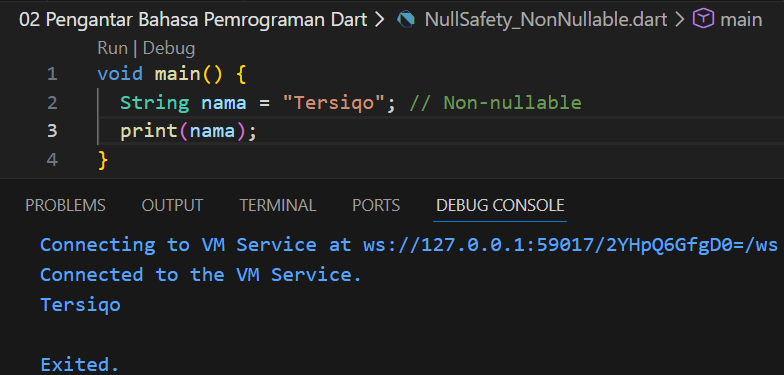
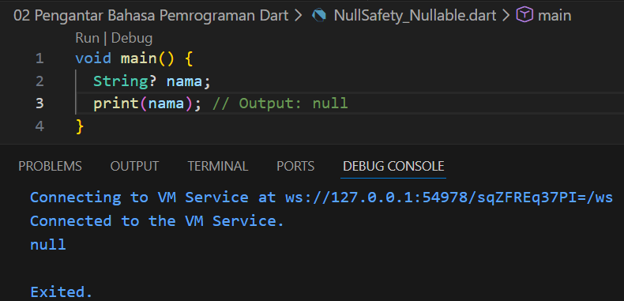
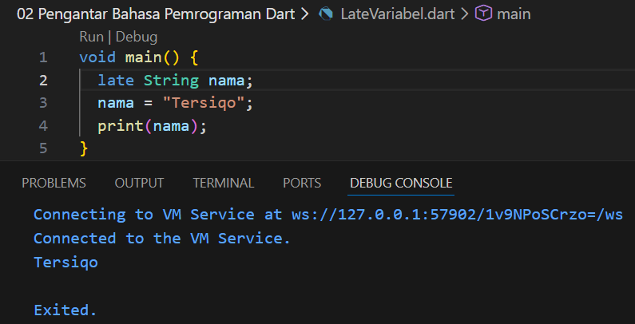

# Laporan Praktikum #02 - Bahasa Pemrograman Dart - Bagian 1

## Identitas Mahasiswa

| Atribut | Nilai                        |
| ------- | -----                        |
| Nama    | Tersiqo Alfarezel            |
| NIM     | 244107060089                 |
| Kelas   | SIB-2D                       |

---

## Tugas Praktikum 2

## Soal 1

Modifikasilah kode pada baris 3 di VS Code atau Editor Code favorit Anda berikut ini agar mendapatkan keluaran (output) sesuai yang diminta!

Jawab:
Berikut adalah hasil modifikasi kode program yang menghasilkan output sesuai dengan yang diminta

## Soal 2

Mengapa sangat penting untuk memahami bahasa pemrograman Dart sebelum kita menggunakan framework Flutter ? Jelaskan!

Jawab:
karena Dart adalah bahasa dasar yang menyusun seluruh ekosistem Flutter, tanpa menguasai logika dasar seperti Pemrograman Berorientasi Objek (OOP) untuk membuat Widget, fitur Null Safety untuk mencegah aplikasi crash, serta pemrograman Asynchronous (Future/await) untuk mengolah data, itu hanya akan sekadar menyalin kode tanpa mampu membangun, mengembangkan, atau memperbaiki logika aplikasi yang kompleks secara mandiri.

## Soal 3

Rangkumlah materi dari codelab ini menjadi poin-poin penting yang dapat Anda gunakan untuk membantu proses pengembangan aplikasi mobile menggunakan framework Flutter.

Jawab :
- Dart adalah mesin, Flutter adalah bodi: Semua widget, plugin, dan logika di Flutter ditulis menggunakan bahasa Dart. Memahami Dart = memahami cara kerja Flutter.
- JIT (Just-In-Time): Digunakan saat coding (development) untuk fitur Hot Reload (ubah kode langsung muncul hasilnya).
- AOT (Ahead-Of-Time): Digunakan saat aplikasi dirilis (production) agar performa sangat cepat karena sudah dikompilasi ke kode mesin native.
- Semua adalah Objek: Di Dart, tidak ada data primitif. Semua adalah class.
- Penting untuk paham Inheritance (pewarisan) dan Constructor karena setiap UI di Flutter adalah sebuah Class Widget.
- Type Safety: Dart mengecek tipe data saat kompilasi untuk meminimalisir bug/error.
- Garbage Collection: Pengaturan memori otomatis (kamu tidak perlu hapus data manual dari RAM).
- void main(): Titik awal wajib setiap aplikasi Dart.
- Operator Unik: ~/ untuk hasil pembagian bilangan bulat (integer) dan == yang membandingkan isi nilai, bukan alamat memori.

## Soal 4

Buatlah penjelasan dan contoh eksekusi kode tentang perbedaan Null Safety dan Late variabel !

Jawab:

## Null Safety
Null Safety adalah fitur keamanan agar aplikasi tidak crash karena mencoba mengakses variabel yang tidak ada isinya (null). Sedangkan Late adalah cara kita memberi tahu Dart: "Sabar, variabel ini belum ada isinya sekarang, tapi saya janji akan mengisinya sebelum dipakai."

### NonNullable
Di Dart modern, semua variabel secara default tidak boleh kosong (null). Jika anda mendeklarasikan variabel tanpa tanda apa pun, maka anda wajib langsung memberi nilai.
- Tujuan: Mencegah error "Null Pointer Exception" yang sering membuat aplikasi crash.

### Nullable 
Jika anda memprediksi bahwa sebuah variabel mungkin tidak memiliki nilai (misalnya data dari internet yang belum masuk), anda harus menandainya dengan tanda tanya (?).
- Tujuan: Memberi tahu Dart bahwa variabel ini "aman" jika berisi null.

### Late Variable
late digunakan untuk variabel yang Non-Nullable, tapi nilainya tidak diberikan sekarang, melainkan nanti.

Kapan pakai? Biasanya untuk variabel yang nilainya didapat setelah fungsi lain (seperti initState di Flutter) berjalan.

## Kesimpulan

- Gunakan ? jika datanya memang mungkin tidak ada.
- Gunakan late jika datanya pasti ada, tapi kamu belum bisa mengisinya di awal baris kode.