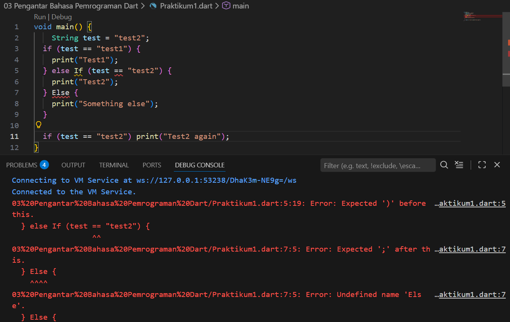
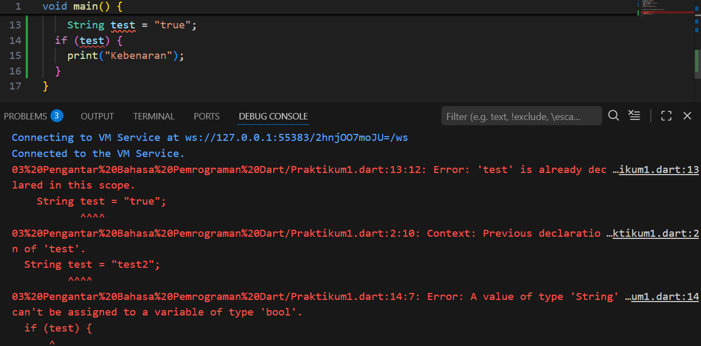
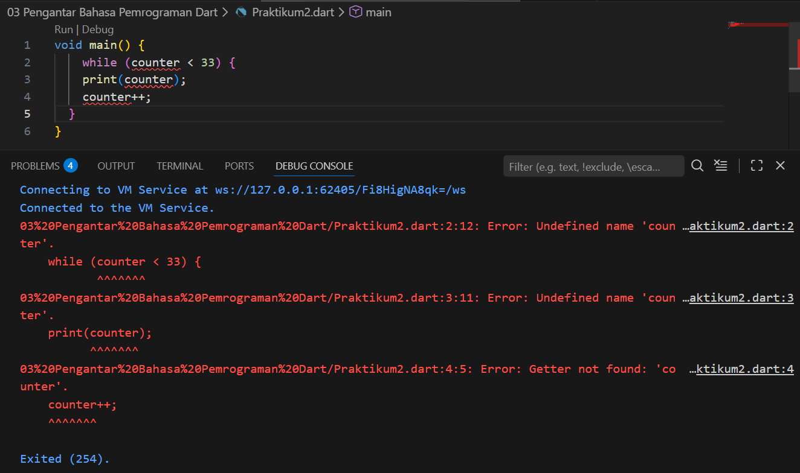
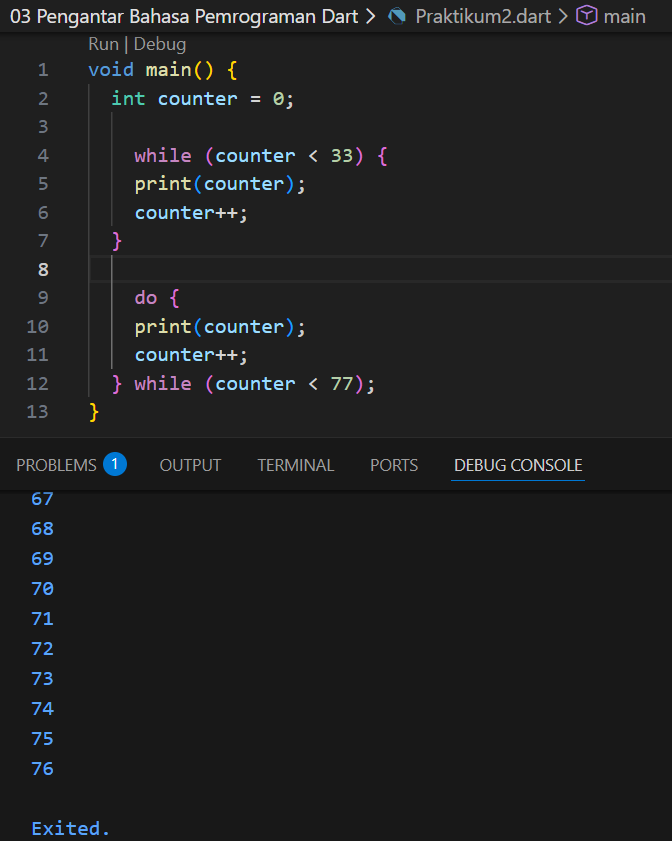
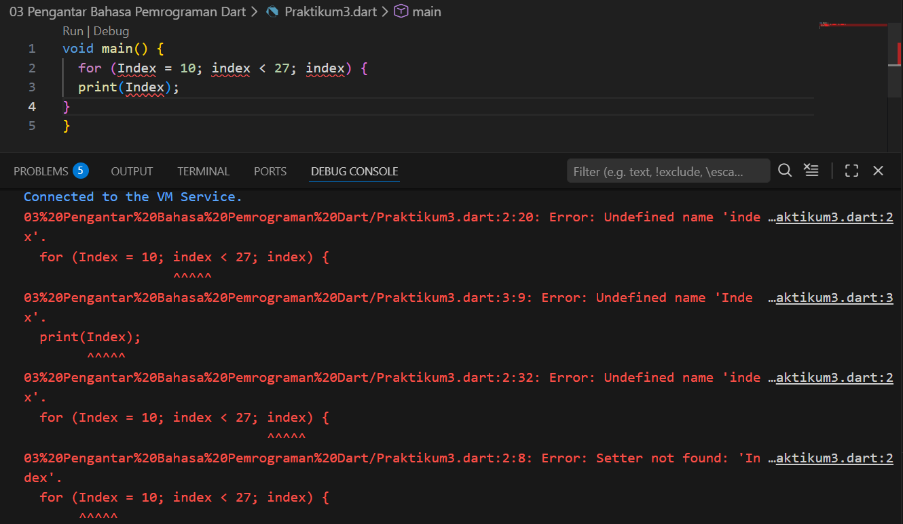
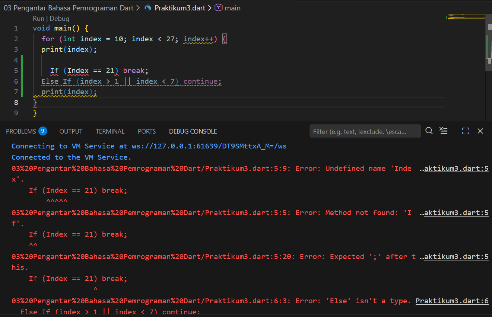

# Laporan Praktikum #03 | Pengantar Bahasa Pemrograman Dart - Bagian 2

## Identitas Mahasiswa

| Atribut | Nilai                        |
| ------- | -----                        |
| Nama    | Tersiqo Alfarezel            |
| NIM     | 244107060089                 |
| Kelas   | SIB-2D                       |
---

# Tugas Praktikum 3

# Soal 1
Silakan selesaikan Praktikum 1 sampai 3, lalu dokumentasikan berupa screenshot hasil pekerjaan beserta penjelasannya!

## Praktikum 1
### Langkah 1:

Ketik atau salin kode program berikut ke dalam fungsi `main()`.

```dart
String test = "test2";
if (test == "test1") {
   print("Test1");
} else If (test == "test2") {
   print("Test2");
} Else {
   print("Something else");
}

if (test == "test2") print("Test2 again");
```

### Langkah 2:

Silakan coba eksekusi (Run) kode pada langkah 1 tersebut. Apa yang terjadi? Jelaskan!



- If dan Else dengan huruf kapital. Di bahasa Dart, itu harus ditulis huruf kecil semua (if dan else).
- Dart menganggap huruf besar dan kecil itu beda jauh. Karena salah tulis satu huruf saja, komputer jadi bingung dan tidak mau memproses kode Anda.

### Langkah 3:

Tambahkan kode program berikut, lalu coba eksekusi (Run) kode Anda.

```dart
String test = "true";
if (test) {
   print("Kebenaran");
}
```

Apa yang terjadi ? Jika terjadi error, silakan perbaiki namun tetap menggunakan if/else



- mendeklarasikan variabel test lagi dengan kata kunci String. Di Dart, variabel dengan nama yang sama tidak boleh dideklarasikan dua kali dalam satu cakupan (scope) fungsi main().
- memasukkan variabel test sebuah String langsung ke dalam kondisi if. Di Dart, kondisi if hanya menerima nilai Boolean (true atau false), sehingga muncul pesan error: "A value of type 'String' can't be assigned to a variable of type 'bool'".

Perbaikannya

.png)

Maka akan muncul 'Kebenaran' sebagai output

## Praktikum 2
### Langkah 1:

Ketik atau salin kode program berikut ke dalam fungsi `main()`.

```dart
while (counter < 33) {
  print(counter);
  counter++;
}
```

### Langkah 2:

Silakan coba eksekusi (Run) kode pada langkah 1 tersebut. Apa yang terjadi? Jelaskan! Lalu perbaiki jika terjadi error.



- menggunakan variabel counter (untuk dibandingkan dengan angka 33 dan ditambah nilainya), tetapi belum membuat (mendeklarasikan) variabel tersebut sebelumnya.

- Perbaikan, membuat variabel counter terlebih dahulu dan memberinya nilai awal sebelum masuk ke dalam perulangan while.

.png)

### Langkah 3:

Tambahkan kode program berikut, lalu coba eksekusi (Run) kode Anda.

```dart
do {
  print(counter);
  counter++;
} while (counter < 77);
```

Apa yang terjadi ? Jika terjadi error, silakan perbaiki namun tetap menggunakan *do-while*.



- Program berhasil dijalankan karena variabel counter sudah dideklarasikan sebelumnya, dan output di Debug Console akan melanjutkan urutan angka sebelumnya.
- Output: Angka akan tercetak mulai dari 33 sampai 76.
- Kondisi Akhir: Perulangan berhenti tepat sebelum angka 77 dicetak.

## Praktikum 3
### Langkah 1:

Ketik atau salin kode program berikut ke dalam fungsi `main()`.

```dart
for (Index = 10; index < 27; index) {
  print(Index);
}
```

### Langkah 2:

Silakan coba eksekusi (Run) kode pada langkah 1 tersebut. Apa yang terjadi? Jelaskan! Lalu perbaiki jika terjadi error.



- Penulisan Index (huruf I besar) dan index (huruf i kecil) secara bergantian. Dalam Dart, keduanya dianggap variabel yang berbeda.

- Variabel index belum dibuat atau belum ditentukan tipe datanya (misalnya int).

- Agar kode ini bisa berjalan dan memunculkan angka dari 10 sampai 26, Anda harus merapikan penulisan hurufnya dan menambahkan perintah penambah nilai (++).

.png)

### Langkah 3:

Tambahkan kode program berikut di dalam *for-loop*, lalu coba eksekusi (Run) kode Anda.

```dart
If (Index == 21) break;
Else If (index > 1 || index < 7) continue;
print(index);
```

Apa yang terjadi ? Jika terjadi error, silakan perbaiki namun tetap menggunakan *for* dan *break-continue*.



- menggunakan If, Else If, dan Index (huruf kapital). Seperti masalah sebelumnya, Dart hanya mengenal huruf kecil untuk perintah logika: if, else if, dan variabel index.

- Kondisi index > 1 || index < 7 akan selalu bernilai benar (true) untuk angka 10 sampai 26. Akibatnya, perintah print(index) di bawahnya tidak akan pernah dieksekusi karena lompatan continue.

- Ubah kondisi continue agar hanya berlaku pada rentang angka tertentu saja, atau hapus jika ingin melihat semua angka sebelum 21.

.png)

# Soal 2
Buatlah sebuah program yang dapat menampilkan bilangan prima dari angka 0 sampai 201 menggunakan Dart. Ketika bilangan prima ditemukan, maka tampilkan nama lengkap dan NIM Anda.

Kodingan

.png)

Output

.png)