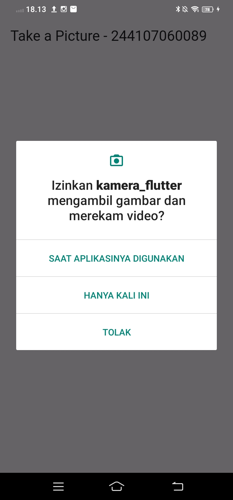
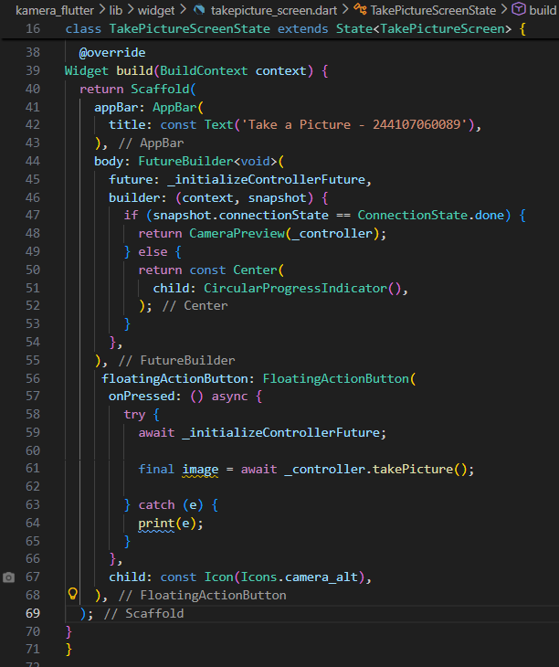
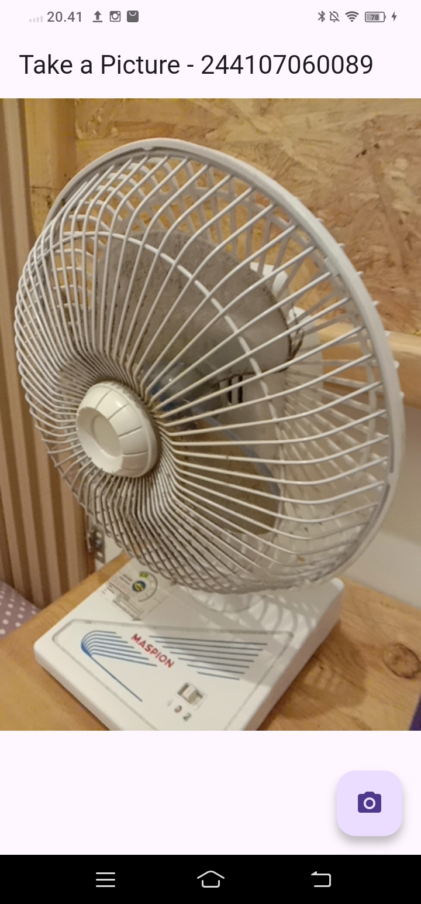
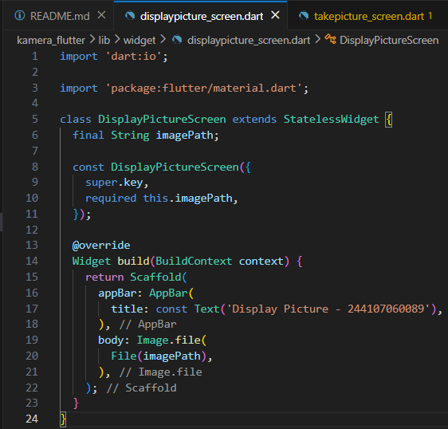
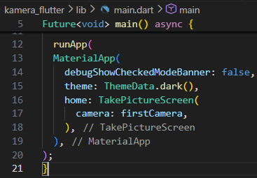
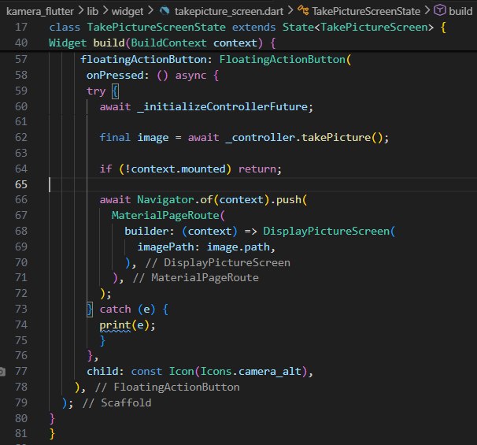
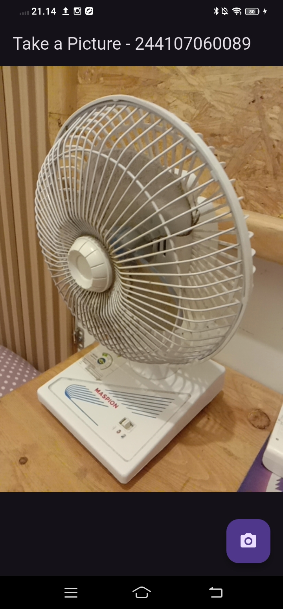
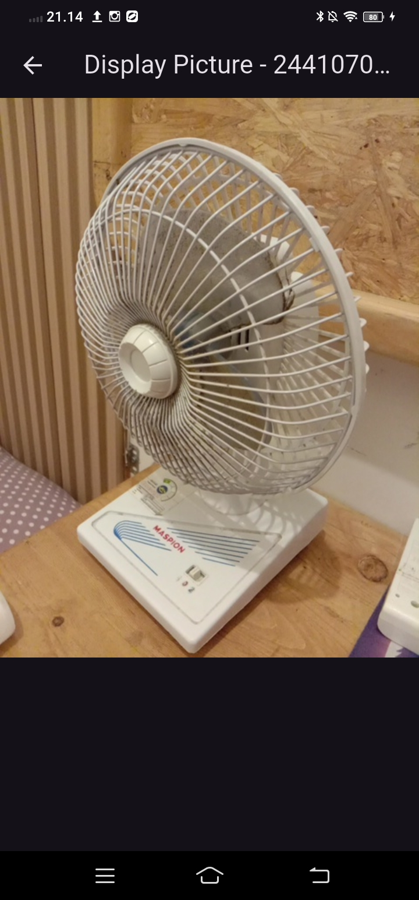

# Laporan Praktikum 09 : Kamera

Nama    : Tersiqo Alfarezel  
NIM     : 244107060089  
Absen   : 21  

## Praktikum 1: Mengambil Foto dengan Kamera di Flutter
1. Langkah 1: Buat Project Baru 
 

2. Langkah 2: Tambah dependensi yang diperlukan 
 
 

3. Langkah 3: Ambil Sensor Kamera dari device 
 

4. Langkah 4: Buat dan inisialisasi CameraController 
 

5. Langkah 5: Gunakan CameraPreview untuk menampilkan preview foto 
 
hasil
 
 

6. Langkah 6: Ambil foto dengan CameraController
 
hasil
 

7. Langkah 7: Buat widget baru DisplayPictureScreen
 

8. Langkah 8: Edit main.dart
 

9. Langkah 9: Menampilkan hasil foto
 

hasil
 
 

## Praktikum 2: Membuat photo filter carousel

## Tugas Praktikum 1
