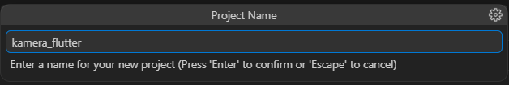
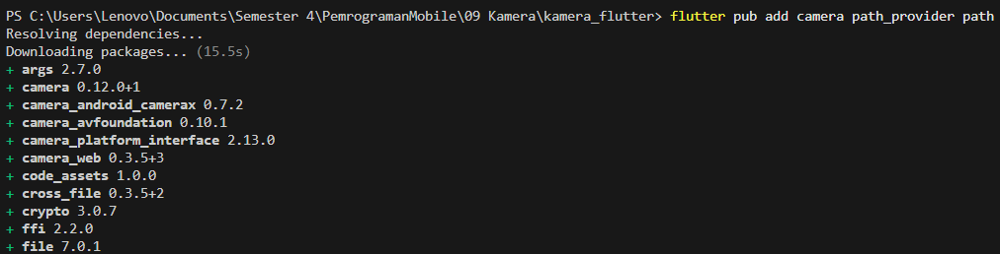
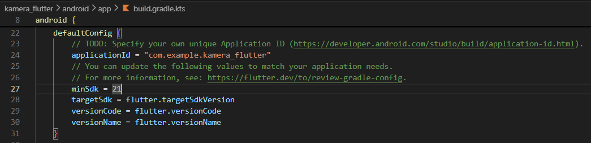
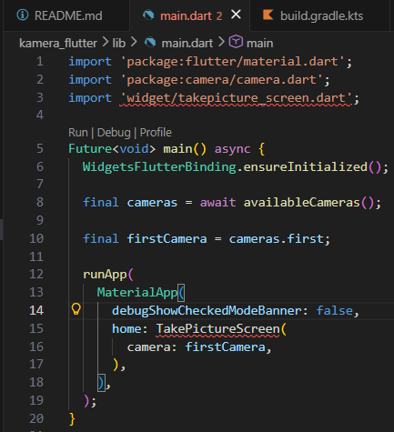
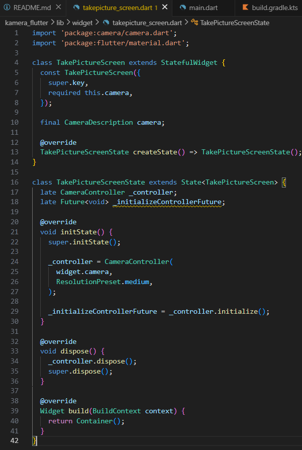
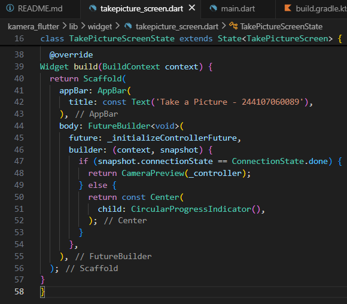
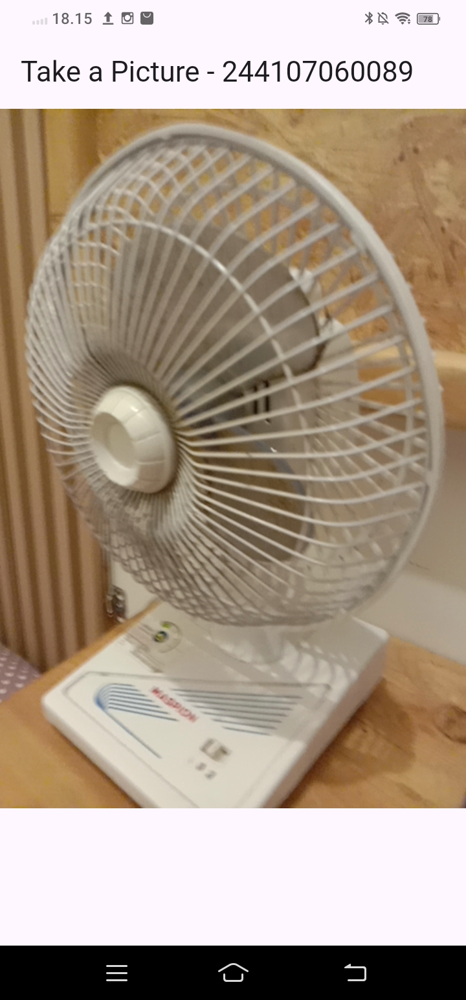

# Laporan Praktikum 09 : Kamera

Nama    : Tersiqo Alfarezel  
NIM     : 244107060089  
Absen   : 21  

1. Langkah 1: Buat Project Baru 
 

2. Langkah 2: Menambahkan Plugin 
 
 

3. Langkah 3: Buat file red_text_widget.dart 
 

4. Langkah 4: Tambah Widget AutoSizeText 
 
Setelah Anda menambahkan kode di atas, Anda akan mendapatkan info error. Mengapa demikian? Jelaskan dalam laporan praktikum Anda!  
- Error terjadi karena plugin auto_size_text belum di-import ke dalam file, sehingga widget AutoSizeText tidak dikenali oleh Flutter. Selain itu, variabel text juga belum dideklarasikan pada class RedTextWidget, sehingga menyebabkan error undefined variable saat digunakan. 

5. Langkah 5: Buat Variabel text dan parameter di constructor 
 

6. Langkah 6: Tambahkan widget di main.dart
 

7. Hasil
 

## Tugas Praktikum 1
1. Selesaikan Praktikum tersebut, lalu dokumentasikan dan push ke repository Anda berupa screenshot hasil pekerjaan beserta penjelasannya di file README.md!

2. Jelaskan maksud dari langkah 2 pada praktikum tersebut!
- Langkah tersebut bermaksud untuk melakukan instalasi dan registrasi plugin auto_size_text ke dalam proyek Flutter Kita. Tujuan utama dari penambahan plugin ini adalah untuk memberikan kemampuan tambahan pada aplikasi agar teks dapat menyesuaikan ukurannya secara dinamis (otomatis mengecil atau membesar) sesuai dengan sisa ruang yang tersedia pada layar. Hal ini sangat penting dalam pengembangan aplikasi mobile agar tampilan antarmuka (UI) tetap rapi dan tidak terjadi layout overflow atau teks terpotong saat dijalankan di berbagai ukuran perangkat yang berbeda.

3. Jelaskan maksud dari langkah 5 pada praktikum tersebut!
- langkah 5 adalah untuk mendefinisikan properti data agar widget bersifat dinamis dan dapat menerima input dari luar. Dengan mendeklarasikan final String text, Kita menyediakan variabel penampung data teks yang bersifat kekal (immutable), sementara penambahan parameter required this.text pada constructor berfungsi untuk mewajibkan pemberi data mengirimkan nilai teks saat widget ini dipanggil. Langkah ini bertujuan agar RedTextWidget tidak bersifat statis, melainkan dapat digunakan secara berulang kali untuk menampilkan pesan teks yang berbeda-beda sesuai kebutuhan.

4. Pada langkah 6 terdapat dua widget yang ditambahkan, jelaskan fungsi dan perbedaannya!
- Widget Pertama (RedTextWidget): Widget ini menggunakan plugin auto_size_text yang telah dikonfigurasi sebelumnya. Meskipun dibungkus dalam Container yang sangat sempit (lebar 50), teks di dalamnya tidak akan terpotong secara kasar; sebaliknya, ukuran font akan mengecil secara otomatis agar tetap muat dan terbaca di dalam area kuning tersebut.
- Widget Kedua (Text standar): Widget ini adalah komponen bawaan Flutter. Karena dibatasi oleh lebar 100 tanpa fitur penyesuaian otomatis, teks pada area hijau ini kemungkinan besar akan terpotong atau berpindah baris secara kaku (overflow), yang sering kali merusak estetika antarmuka jika teksnya terlalu panjang.

5. Jelaskan maksud dari tiap parameter yang ada di dalam plugin auto_size_text berdasarkan tautan pada dokumentasi ini !
- minFontSize: Parameter ini menentukan batas ukuran font terkecil yang diizinkan. Saat teks terlalu panjang untuk ruang yang tersedia, sistem akan mengecilkan font, namun tidak akan pernah lebih kecil dari nilai yang Anda tentukan di sini.

- maxFontSize: Parameter ini menetapkan batas ukuran font maksimal. Jika tidak diatur, widget akan menggunakan ukuran font default. Parameter ini berguna untuk menjaga agar teks tidak terlihat terlalu besar meskipun tersedia banyak ruang kosong.

- stepGranularity: Parameter ini menentukan seberapa halus perubahan ukuran font saat proses penyesuaian. Misalnya, jika diatur ke angka 1, maka font akan berkurang sebesar 1 poin setiap tahap pengecilan hingga teks muat di dalam kontainer.

- presetFontSizes: Jika Anda tidak ingin font mengecil secara acak, Anda bisa memberikan daftar ukuran font tertentu (misalnya [20, 16, 12]). Plugin hanya akan memilih ukuran dari daftar tersebut yang paling pas untuk mengisi ruang yang tersedia.

- maxLines: Parameter ini sangat penting karena menentukan jumlah baris maksimal yang diizinkan. Jika teks masih tidak muat setelah mencapai minFontSize dan batas maxLines, maka teks tersebut akan dipotong (biasanya dengan tanda elipsis ...).

- group: Parameter ini memungkinkan beberapa widget AutoSizeText untuk sinkron. Jika satu widget mengecilkan ukuran font-nya, semua widget lain dalam grup yang sama akan ikut mengecil agar ukuran font di seluruh UI tetap terlihat seragam dan konsisten.

- overflow: Sama seperti widget Text biasa, parameter ini menentukan apa yang terjadi jika teks tetap tidak muat meskipun sudah mencapai ukuran font terkecil (minFontSize). Opsinya bisa berupa TextOverflow.ellipsis (muncul titik tiga), clip (terpotong), atau fade (memudar).

- style: Digunakan untuk menentukan gaya dasar teks, seperti ketebalan font (weight), warna, dan jenis font (font family). Ukuran font yang Anda tentukan di dalam style ini akan dianggap sebagai ukuran awal sebelum plugin mencoba mengecilkannya.

- textAlign: Mengatur perataan teks di dalam kontainer, apakah ingin rata kiri, tengah, rata kanan, atau rata kiri-kanan (justify).

- wrapWords: Parameter berupa nilai boolean yang menentukan apakah kata-kata yang panjang boleh dipotong atau dipindahkan ke baris baru saat proses pengecilan font dilakukan.

- textKey: Digunakan untuk memberikan identitas (Key) khusus pada widget Text internal yang digunakan oleh auto_size_text, yang berguna untuk keperluan pengujian (testing) atau pelacakan widget.

6. Kumpulkan laporan praktikum Anda berupa link repository GitHub kepada dosen!